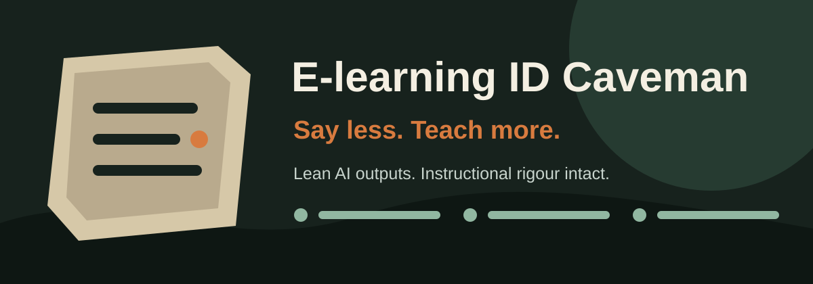

<p align="center">
  
</p>

# E-learning ID Caveman

**Say less. Teach more.**

An AI skill for e-learning developers and instructional designers. It removes filler while protecting learning objectives, instructional alignment, assessment validity, accessibility, and production-critical details.

> **Core rule:** Compress expression, not learning design.

## Why this exists

AI can produce pages of polished text that still leave an instructional designer with more editing work. E-learning ID Caveman makes outputs shorter, clearer, and closer to production-ready.

It helps with:

- measurable learning objectives;
- course outlines and microlearning;
- screen-level storyboards;
- learner-facing scripts;
- MCQs, scenarios, branching and confidence ratings;
- targeted automated feedback;
- Articulate Storyline 360 specifications;
- Rise 360 lesson structures;
- accessibility reviews;
- LMS and e-learning QA reports.

## Four modes

| Mode | Best for | Output style |
|---|---|---|
| `lite` | Stakeholder and SME communication | Polished; obvious filler removed |
| `lean` | Everyday ID work | Compact, structured, complete |
| `ultra` | Developer handoff | Essential production specification only |
| `learner` | On-screen learner copy | Brief, supportive, natural language |

Default: `lean`.

## Before and after

**Prompt:** Create an objective for data analysts learning to identify hallucinated AI output.

**Typical AI output**

> By the end of this module, learners will develop an understanding of the various characteristics associated with hallucinated responses generated by artificial intelligence systems and become familiar with techniques that may be used to identify them.

**E-learning ID Caveman**

> Given an AI-generated analysis, identify unsupported claims using the supplied evidence checklist.

Shorter—and measurable.

See [more examples](examples/before-after.md).

## Installation

### Agent Skills installer

```bash
npx skills add linuxsunil/Elearning-ID-Caveman
```

Select your supported AI agent when prompted.

### Manual installation

Copy this repository into your agent's skills directory. Keep `SKILL.md`, `agents/`, and `references/` together.

### Use without installation

Paste `SKILL.md` into your AI project instructions, then add the relevant reference file when working on assessments or authoring-tool QA.

## Example prompts

```text
Use E-learning ID Caveman in learner mode to rewrite this screen.
```

```text
Storyboard this SME content in lean mode for Rise 360.
```

```text
Create five Bloom L3 scenario questions with targeted feedback.
```

```text
Ultra mode: specify the Storyline objects, variables, states and trigger order.
```

```text
QA this module. Report genuine defects separately from enhancements.
```

## What it protects

Brevity never overrides:

- accuracy and safety;
- learner-critical context;
- objective–practice–assessment alignment;
- feedback quality;
- accessibility;
- scoring and completion rules;
- Storyline object names, variables, states and trigger order;
- JavaScript, file paths and error messages.

## Repository map

```text
.
├── SKILL.md
├── agents/openai.yaml
├── references/
│   ├── assessment-patterns.md
│   └── authoring-and-qa.md
├── examples/
│   ├── before-after.md
│   ├── storyboard-example.md
│   ├── assessment-example.md
│   └── qa-report-example.md
└── assets/
    └── elearning-id-caveman-banner.svg
```

## Philosophy and attribution

E-learning ID Caveman is inspired by [JuliusBrussee/caveman](https://github.com/JuliusBrussee/caveman), which demonstrates that AI agents can communicate effectively with fewer output tokens.

This project applies the brevity principle to instructional design. It is an independent project and is not affiliated with or endorsed by the original Caveman project.

## Author

Created by [linuxsunil](https://github.com/linuxsunil), an instructional designer exploring practical AI applications for e-learning development.

## Contributing

Ideas, examples and corrections are welcome. Read [CONTRIBUTING.md](CONTRIBUTING.md) before opening a pull request.

## Licence

Released under the [MIT License](LICENSE).
